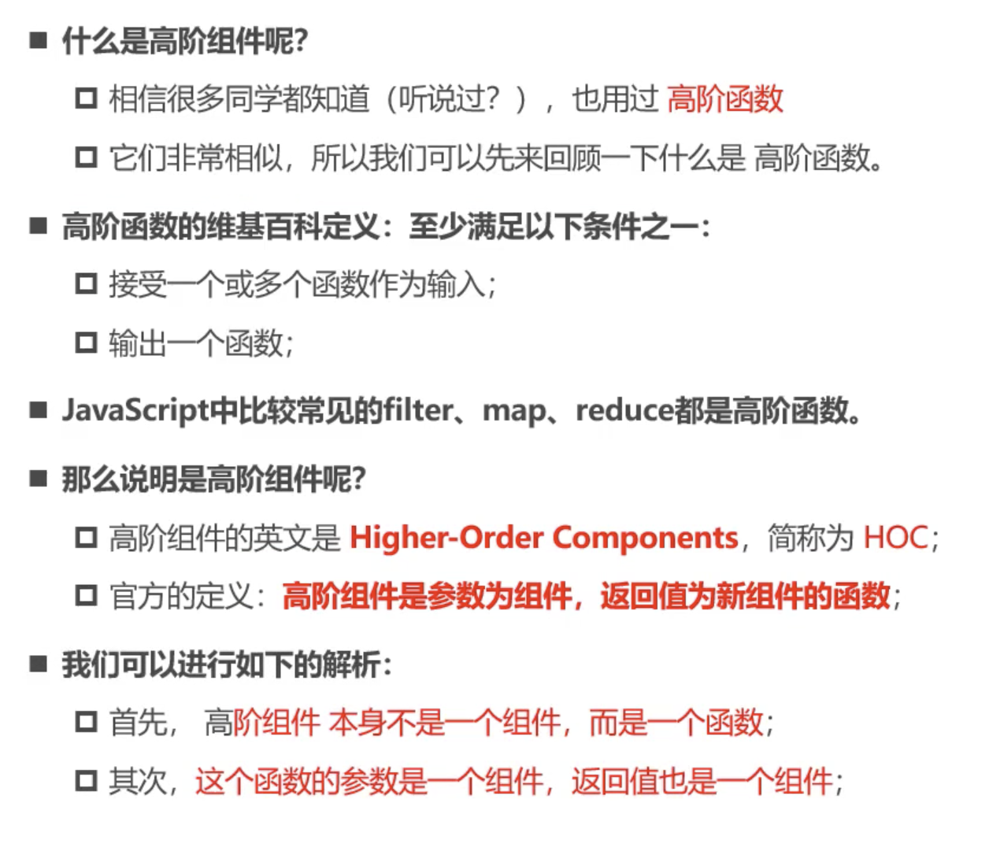
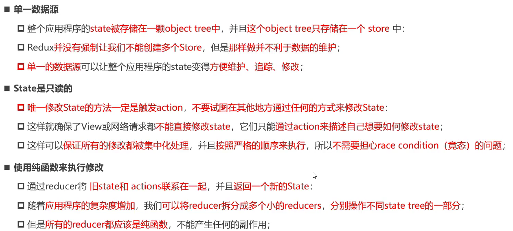
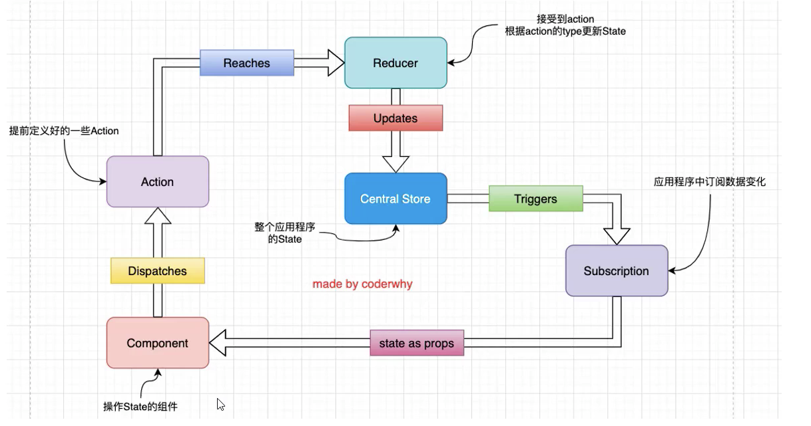

# jsx语法中让回调函数内部this正确访问类实例的方法

1. 类组件中，自定义函数内部this绑定组件实例的方式：

   1. bind修改类函数this：constructor中：`this.fn = fn.bind(this)`

   2. 使用class field特性：

      constructor之外定义的变量和方法和constructor中`this.`定义的变量和方法完全一样，只是constructor中`this.`的定义会对其进行覆盖；我们在constructor之外定义一个箭头函数，然后这个箭头函数里面的this就是类实例，我们绑定事件时直接使用这个箭头函数

      （这个原理暂时不是很懂）

   3. 绑定一个箭头函数，箭头函数的函数体内容就是调用类方法

      ~~~jsx
      <button onclick={() => this.fn() }>按钮</button>
      ~~~

      原理就是我们`{}`里面的是一个箭头函数，首先我们在jsx模板中是可以通过this访问class实例的，可以理解为jsx中的`{}`就是一个函数作用域，这个函数属于我们的类实例对象，就比如

      ~~~JS
      let obj = {
          name: "jrd",
          fn() {
              // jsx语法中的{}就类似于这里，obj就相当于组件类实例。我们在这里可以通过this访问obj，类似于jsx的{}中可以通过this访问类实例对象
          }
      }
      ~~~

      然后上面`onclick={() => this.fn() }`就类似于我们在`fn`中创建了一个箭头函数，这个箭头函数的父级作用域就是`fn`的函数作用域，`fn`属于`obj`，自然这个箭头函数中的this就是obj，类比到jsx中，说明this就是类实例，既然`this.fn()`中this是类实例，所以`fn`的调用方式就是被`this`调用，所以`fn`内部的this就都指向了`this`，也就是类实例

   

   不进行处理类方法中的this绑定不到类实例的原因：

   ~~~jsx
   <button onclick={this.fn}>按钮</button>
   ~~~

   这里相当于一个函数体赋值，我们只是把this.fn的函数体赋值给了一个内部变量，在触发onclick事件的时候，其实是对{}内的函数进行独立调用（直接调用），所以我们相当于直接执行`fn`，并没有执行`this.fn`，这就导致fn是没有`this`的，而是属于window的，所以fn函数体里的this都无法正常访问类实例的属性

# 函数传参

~~~jsx
class App extends React.Component {
    constructor() {
        super();
        this.state = {
            massage: "hello world"
        }
    }
    
    btnClick(event, name, age) {
        console.log("...")
    }
    
    reder() {
        const { message } = this.state;
        return (
        	

                {/* 直接箭头函数接收event事件对象，然后函数体内给回调函数传参即可 */}
            	<button onclick={(event) => this.btnClick(event, "why", 18)}>按钮</button>
            

        )
    }
}
~~~

# 创建脚手架项目

`npm install create-react-app -g`：全局安装react脚手架

`create-react-app demo`：创建名为demo的项目

`npm run start`：跑起来当前项目

# React组件化

## ref

### ref获取原生dom的三种方式

~~~jsx
import React, { PureComponent, createRef } from 'react'

export class App extends PureComponent {
  constructor() {
    super();
  }
  this.state = {};
	this.titleRef = createRef();
	this.titleEl = null;
	getNativeDom() {
    // 1.方式一: 在React元素上绑定一个ref字符串
    // console.log(this.refs.jrd);
    
    // 2.方式二: 提前创建好ref对象，createRef(),将创建出来的对象绑定到元素上
    // console.log(this.titleRef.current);
    
    // 3. 方式三: 传入一个回调函数，在对应元素被渲染之后，回调函数被执行，并且将元素作为参数传入
    console.log(this.titleEl);
  }
	render() {
    return (
    	

      	<h2 ref="jrd">方法一：hello 杨静</h2>
        <h2 ref={this.titleRef}>方法二：你好啊，react</h2>
        <h2 ref={el => this.titleEl = el}>方法三：你好啊 jsx</h2>
      

    )
  }
}

export default App
~~~

### ref获取组件

#### 获取类组件实例

1. 创建ref实例
2. 模版中给组件绑定ref属性为ref实例
3. ref实例.current即为类组件实例

~~~jsx
import React, { PureComponent, createRef } from 'react'

// HelloWorld子组件
class HelloWorld extends PureComponent {
  
  test() {
    console.log("父组件拿到HelloWorld实例之后可以直接对他的方法进行调用");
  }
  
  render() {
    return <h1>hello world</h1>
  }
}

// App父组件
export class App extends PureComponent {
  constructor() {
    super();
    this.myRef = createRef(); // 创建ref实例
  }
  this.state = {};

	getComponent() {
		console.log(this.myRef.current);
  }

	render() {
    return (
    	

				<HelloWorld ref={this.myRef}/>
        <button onClick={e => this.getComponent()}>获取组件实例</button>
      

    )
  }
}

export default App
~~~

#### 获取函数组件

总结：通过forwardRef包裹函数式组件，然后函数式组件除了能接收props参数之外，还能接收第二个参数ref，这个ref就是父组件里绑定给函数式组件的，然后函数式组件内部把这个ref实例绑定给模版中的某个dom元素，然后父组件中的ref实例拿到的就是函数式组件内部的某个dom了。

函数式组件压根就没有实例，不能直接给函数式组件绑定ref属性

~~~jsx
import React, { PureComponent, createRef } from 'react'

// HelloWorld子组件
function HelloWorld {
  return (
  	

    	<h1>hello world</h1>
    

  )
}

// App父组件
export class App extends PureComponent {
  constructor() {
    super();
    this.myRef = createRef();
  }
  this.state = {};

	getComponent() {
		console.log(this.myRef.current);
  }

	render() {
    return (
    	

				<HelloWorld ref={this.myRef}/> {/* 报错：不能给函数式组件绑定ref */}
        <button onClick={e => this.getComponent()}>获取组件实例</button>
      

    )
  }
}

export default App
~~~

我们可以通过forwardRef绑定函数式组件中的某个dom（或者类组件）：

~~~jsx
import React, { PureComponent, createRef, forwardRef } from 'react'

// HelloWorld子组件
const HelloWorld = forwardRef(function(props, ref) {
  return (
  	

    	<h1 ref={ref}>hello world</h1>
    

  )
})

// App父组件
export class App extends PureComponent {
  constructor() {
    super();
    this.myRef = createRef();
  }
  this.state = {};

	getComponent() {
		console.log(this.myRef.current); // 按钮点击后输出<h1 ref={ref}>hello world</h1> 
  }

	render() {
    return (
    	

				<HelloWorld ref={this.myRef}/>
        <button onClick={e => this.getComponent()}>获取组件实例</button>
      

    )
  }
}

export default App
~~~

## 受控组件与非受控组件

### 受控组件概念：

给表单组件通过`value`绑定了某个值之后比如：`<input type="text" value={username}/>`，这时候这个input就没法输入了，这时候他就是一个受控组件（vaue值受到了我们的控制），要想实现双向数据绑定，就必须要制定表单元素对应的回调函数，回调函数中通过事件对象（拿到输入值）去修改我们绑定的变量。

#### 举例：

曾经我们登陆注册等与后端交互的业务，一般是通过表单，`submit`事件被触发后，`form`表单自动向`action`属性指定的地址发送网络请求，但是目前我们基本不这样做了，而是：

1. 阻止表单的默认行为
2. **通过受控组件收集用户数据**
3. 通过按钮的点击事件触发回调：整理数据并发送网络请求。

### 多个受控组件（结合name属性）用同一个函数处理

~~~jsx
<input
  type="password"
	name="password" // name属性与value变量同名
  value={password}
  onChange={e => this.handleInputChange(e)}
/>
<input
  type="username"
	name="username"
  value={username}
  onChange={e => this.handleInputChange(e)}
/>

handleInputChange(event) {
  this.setState({
    [event.target.name]: event.target.value; // 根据event.target.name区别操作的是哪一个受控组件
  })
}
~~~

### checkbox单选与多选的受控（空）

### select单选与多选的受控（空）

### 非受控组件的使用

1. 我们不能通过`value`给组件绑定变量，但是可以用`defaultValue`等`default`开头的属性给表单元素绑定初始值
2. 使用`ref`来获取`input`元素
3. 通过`ref.current.value`来获取数据

**受控组件的表单数据是由React组件来管理的；非受控组件是由DOM节点来处理的。说白了非受控组件就是操作dom，react官方不推荐。**

## 高阶组件

### 概念

一般来讲高阶组件还是返回接收的组件，说白了就是应用组件之前多了一层**拦截**。并不是React API的一部分，而是基于react组合特新而形成的设计模式。

### 应用举例——Context

#### context的传统使用方式：

App.jsx：

~~~jsx
import ThemeContext from './context/theme_context'

export class App extends PureComponent {
  render() {
    return (
    	

        <ThemeContext.Provider value={{color: "red", size: 30}}>  // 相当于传递了一个{color: "red", size: 30}对象，ThemeContext.Consumer中回调函数的参数拿到的就是这个{color: "red", size: 30}对象
        	<Product />
        </ThemeContext.Provider>
      

    )
  }
}
~~~

Product.jsx：

~~~jsx
import ThemeContext from './context/theme_context'

export class Product extends PureComponent {
  render() {
    return (
    	

        <ThemeContext.Consumer> 
        	{
            value => {
              return <h2>theme: {value.color}-{value.size}</h2>
            }
          }
        </ThemeContext.Consumer>
      

    )
  }
}
~~~

theme_context.js：

~~~js
import { createContext } from "react";

const ThemeContext = createContext();

export default ThemeContext;
~~~

#### 高阶组件解决方案

with_theme.js：

~~~js
import ThemeContext from "../context/theme_context"

function withTheme(OriginComponent) {
  return (props) => {
    return (
    	<ThemeContext.Consumer>
      	{
          value => {
          	return <OriginComponent {...value} {...props}/>
        	}
        }
      </ThemeContext.Consumer>
    )
  }
}
export default withTheme;
~~~

Product.jsx：

~~~jsx
export class Product extends PureComponent {
  render() {
    const { color, size } = this.props;
    
    return (
    	
{color} - {size}

    )
  }
}

export default withTheme(Product);  // Product通过withTheme包裹之后，ThemeContext对象里的属性都作为Product的props传递给Product
~~~

# 组件通信

## 1.父传子props

父组件直接把数据在子组件标签中传给子组件；子组件的`contructor`函数接收一个`props`参数，然后调用`super(props)`。

子组件经过上述操作，就可以通过`this.props.父组件传来的数据`的方式获取到父组件传来的数据

父组件：

~~~jsx
<Child banner={banners}/>
~~~

子组件：

~~~jsx
export class AddCounter extends Component {
	constructor(props) {
        super(props)
    }
    
    render() {
        const { banners } = this.props
        return (
        	{/* 使用数据banners */}
        )
    }
}
~~~

## 2.子传父

父组件内部有操作组件内数据的方法，然后直接给子组件传递一个“包装函数”，即对自身方法的包装，函数体内是对自身方法的调用。**且这个函数是一个箭头函数。**

概况来说：父组件传给子组件的箭头函数就是为了调用真正修改数据的函数

子组件的某些事件触发子组件内的某个回调函数，回调函数的逻辑就是通过`this.props.父组件传来的方法`去调用父组件传递的箭头函数。

父组件：

~~~jsx
class App extends React.Component {
    constructor() {
        super();
        this.state = {
            counter: 0,
        }
    }

    changeCounter(counter) {
        this.setState({ counter: this.state.counter + counter })
    }	
    
    render() {
        const { counter } = this.state;
        return (
            

                <h2>当前计数：{counter}</h2>
                <AddCounter addClick={(count) => this.changeCounter(count) }/>
            

        )
    }
}

export default App;
~~~

子组件：

~~~jsx
export class AddCounter extends Component {
    addCount(count) {
        /*
        	因为addClick是父组件中传来的箭头函数，所以addClick函数体中的this一直都指向的是父组件实例，不会因为这里的调用方式而改变
        */
        this.props.addClick(count);
    }
    
    render(
    	

    		<button onclick={() => this.addCount(1)}>+1</button>
        	<button onclick={() => this.addCount(2)}>+2</button>
        	<button onclick={() => this.addCount(5)}>+5</button>
    	

    )
}
~~~

## 3.借助`React.createContext()`

1. 建立一个上下文对象

~~~js
import React from "react";

const ThemeContext = React.createContext();

export default ThemeContext
~~~

2. 通过上下文对象标签（ThemeContext上下文对应的上下文标签：<ThemeContext.Provider>）的的`value`属性给上下文标签内部的子组件传递数据

~~~jsx
<ThemeContext.Provider value={{color: "red", size: "30"}}>
    <Home></Home>
</ThemeContext.Provider>
~~~

3. 上下文标签内部的子组件（**后代组件**）需要绑定上下文（上面2相当于上下文提供了数据，但组件还没接收），然后才能使用上下文数据

Home组件的子组件HomeInfo组件：

~~~jsx
export class HomeInfo extends Component {
    reder() {
        return (
            {/* 组件内部直接使用上下文标签的value属性提供的数据 */}
        	
{this.context.red}

        )
    }
}

//组件暴露前绑定上下文
HomeInfo.contextType = ThemeContext

export default HomeInfo
~~~

函数式组件中获取上下文提供的数据：

我们在想使用数据的地方使用上下文对应的<ThemeContext.Consumer>标签，标签内部的{}内是一个函数，这个函数接收的第一个参数就是<ThemeContext.Provider>的value属性，通过value属性自然就可以拿到数据了

~~~jsx
import ThemeContext from "..."

function HomeBanner() {
    return 

    	<ThemeContext.Consumer>
        	{
                value => {
                    return <h2>{ value.color }</h2>
                }
            }
        </ThemeContext.Consumer>
    

}
~~~

当然<ThemeContext.Consumer>不只是在函数组件中使用，如果一个自定义组件在很多个嵌套的上下文标签内部，绑定上下文对象只能绑定一个，所以他如果想获得多个上下文的数据，可以使用<ThemeContext.Consumer>，与绑定的那个上下文`this.context`不冲突。

# 组件的生命周期

常用：

* constructor
* render
* componentDidMount
* componentDidUpdate
* componentWillUnmount

# 类型验证

* propTypes
* defaultProps

# react实现插槽效果

## this.props.children

父组件中直接往子组件的中间放dom元素，放在自定义组件中间的dom元素会按顺序出现在子组件的`props.children`数组中，这里所说的dom是指jsx中的dom，自然子组件中通过`this.props.children[index]`访问到的自然是jsx语法下的dom元素，这个元素直接可以在子组件的jsx模板中使用。

父组件：

~~~jsx
render() {
    return (
        

            <NavBar>
                <button>按钮</button>
                <h2>标题</h2>
                <i>斜体文字</i>
            </NavBar>
        

	)
}
~~~

子组件：

~~~jsx
render() {
    const { children } = this.props;
    return (
        

            
{children[0]}

            
{children[1]}

            
{children[2]}

        

    )
}
~~~

plus：如果父组件中，子组件的中间只传递了一个dom标签，那么子组件内部`this.props.children`就是这个dom，而不是一个数组。

## this.props（推荐）

在父组件中我们直接给子组件标签传递属性，但是我们传递的属性值就是jsx的dom元素，所以我们在子组件中通过`this.props`解构赋值就可以拿到父组件传来的dom元素，而不用借助`children`属性

子组件：

~~~jsx
render() {
    const { leftSlot, centerSlot, rightSlot } = this.props;
    return (
        

            
{leftSlot}

            
{centerSlot}

            
{rightSlot}

        

    )
}
~~~

父组件：

~~~jsx
render() {
    return (
        

            <NavBar
            	leftSlot={<button>按钮</button>}
                centerSlot={<h2>标题</h2>}
                rightSlot={<i>斜体文字</i>}
            />
        

	)
}
~~~

## 作用域插槽

概念：我们父组件决定子组件使用什么dom结构（标签），数据仍然是子组件自身的。

实现：父组件直接传给子组件一个返回dom结构的函数，子组件自己去调用这个函数并传入自身的数据来生成最终的jsxDOM即可

父组件：

~~~jsx
render() {
    return (
        

            <NavBar
            	itemType={(item) => <button>{item}</button>}
            />
        

	)
}
~~~

子组件：

~~~jsx
render() {
    const { itemType } = this.props;
    return (
        

            {itemType(子组件本身的数据)}
        

    )
}
~~~

# CSS方案

## css modules

css modules不是React特有的方案，而是打包工具提供的方案：比如webpack环境下，配置webpack.config.js的modules:true

React脚手架已经内置了css modules的配置，所以我们可以直接使用这种css方案：

1. .css/.less/.scss等样式文件都需要改成.module.css/.module.less/.module.scss
2. 在组件中引入.module.css样式模块：`import Style1 from "./profile.module.css"`
3. 在jsx的模版中使用：`

`

`profile/Profile.jsx`:

~~~jsx
import { memo } from 'react';
import profileStyle from "./Profile.module.css";

const Profile = memo(function() {

    return (
      	// className中使用多个css类名——用()包裹；使用单个css类不需要()
        

        	hello
        

    )
})

export default Profile;
~~~

`profile/Profile.module.css`：

~~~css
.section {
    border: 1px solid skyblue;
}

.anotherSection {
    background-color: aqua;
}
~~~

Css modules的css方案可以解决react组件之间样式冲突问题：原理就是浏览器中真正生成的css类名其实为：`文件名_css类名_一段随机哈希字符串`。

缺点：css文件中编写类名时不能使用`-连接符，因为js中不识别，只能用单个字符串（或者驼峰式）命名；不方便动态修改某些样式，需要借助内联样式实现

## css in js（终极方案）

借助styled-components库

`npm install styled-components`

vscode插件：vscode-styled-components（css代码语法高亮）

---

Plus标签模版字符串的使用：

~~~typescript
function foo(...args) {
  console.log(args);
}

foo("why", 18, 1.88); // 普通调用
foo`my name is ${name}, age is ${age}` // 标签模版字符串调用函数： 函数`paramsStr`
~~~

标签模版字符串的输出：

~~~js
[
  ['my name is', 'age is', ''],
  "why",
  18
]
~~~

也就是说，如果用``给某个函数传参的话，会把模版字符串的内容以${}进行分割，第一个参数是一个数组，数组里的项就是${}分割之后的子字符串，剩下的第二第三...等参数就依次是${}进行变量替换后的结果

---

styled-components基本使用：

`style.js`：

~~~js
import styled from "styled-components";

export const AppWrapper = styled.div`
	.section {
		border: 1px solid red;
		
		.title {
			font-size: 30px;
			
			&:hover {
				background-color: purple;
			}
		}
	}
	
	.footer {
		border: 1px solid orange;
	}
`
~~~

原理上来讲就是styled-components提供的styled对象里面有很多方法，div就是其中的一个方法，这个方法最终返回一个组件（div函数根据``接收的参数给它的子类添加样式，具体咋实现的那就是styled-components完成的事情了），我们就是拿着这个组件去用就行了

`App.jsx`：

~~~jsx
import React, { PureComponent } from 'react';
import { AppWrapper } from "./style";

export class App extends PureComponent {
  render() {
    return (
    	<AppWrapper>
      	

        	<h2 className='title'>我是标题</h2>
        

        

        	
hhh

        

      </AppWrapper>
    )
  }
}

export default App
~~~

<AppWrapper>相当于我们用styled.div方法创建出来的div标签，这个组件与div的不同之处就在于这个组件会给它的子元素添加样式。

# React性能优化

我们在`extends Component`的类组件中，只要是调用`this.setState`就会触发`render`函数的执行，包括里面所有的自组件默认情况下都会重新渲染，为了减少无效render（数据没变）的频率，我们需要在`shouldComponentUpdate(nextProps, newState)`生命周期中进行逻辑判断是否state或者props发生改变，对应返回true或false（是否渲染）。为了避免这种繁琐的逻辑判断：

只需要让类组件继承PureComponent：组件会自动进行判断state或者props是否发生改变，改变则调用render

我们希望函数组件也能根据props是否改变来决定是否重新渲染，就需要用到react提供的memo方法：

~~~js
import { memo } from "react";

const Profile = memo(函数组件函数); // memo接收原来的函数组件，返回一个组件，这个组件就有自动判断是否render的功能

export default Profile;
~~~

# React Hooks

作用：在不使用类组件的前提下，让函数组件中使用state以及react生命周期等特性

## useState

函数组件结合hook（useState）实现计数器组件：

~~~jsx
import React, { useState } from "react";

export default function Counter() {
  const [count, setCount] = useState(0);
  
  return (
  	

    	<h2>当前计数：{count}</h2>
      <button onClick={e => setCount(count + 1)}>+1</button>
      <button onClick={e => setCount(count - 1)}>-1</button>
    

  )
}
~~~

只能在函数的最外层调用hook（不能放在if中等子作用域）

useState的实现原理：usestate会在一个函数组件外部（反正不随函数组件的执行完毕而销毁）定义一个state变量，这其实就等价于class组件中的this.state，实现函数组件state状态保留的效果。

（useState这种函数就是一个hook）

## useEffect

对于函数组件来说，把类似于网络请求、DOM操作（比如如下的修改document.title）、事件监听等逻辑放到函数体的最上层是不合理的，这些事情都是组件渲染带来的副作用，这也就是useEffect的意思：把渲染组件伴随的副作用逻辑放到useEffect的回调函数中

实现计数器数值改变时修改document.title：

~~~jsx
import React, {memo} from "react";
import { useState, useEffect } from "react";

const App = memo(() => {
  const [count, setCount] = useState(200);
  
  useEffect(() => { // 当前回调函数会在组件被渲染完成后自动执行
    document.title = count;
  })
  
  return (
    

    	<h2>当前计数：{count}</h2>
      <button onClick={e => setCount(count+1)}>+1</button>
    

  )
})

export default App;
~~~

在类组件的编写中，某些副作用代码（比如取消订阅之类的），我们需要在componentWillUnmount中进行清除，对应函数组件，我们利用useEffect的回调函数的返回值来进行模拟：

useEffect回调函数的返回值是一个函数，这个函数在每次组件更新或以及卸载的时候执行：

~~~jsx
useEffect(() => {
  console.log("副作用逻辑")
  return () => {
    console.log("清除副作用的逻辑——副作用逻辑执行之前会先执行上一次useEffect返回的回调函数")
  }
})
~~~

**一个函数式组件中，可以存在多个useEffect**，这样就可以把相关的副作用逻辑放在一起，还有好处就是方便抽取一个useEffect为一个自定义hook（后面学习）

### 控制回调的执行

useEffect的第二个参数（可选参数），如果省略就相当于这个useEffect的回调在每次组件渲染时都会执行；显式指定第二个参数为一个数组，里面存放变量，表示只有数组中的变量发生改变时才会执行这个useEffect回调；如果第二个参数为空数组，则代表这个回调函数的执行与任何变量都不相关，所以只有在函数组件第一次渲染时执行，其返回的回调函数也只在函数组件卸载时执行一次。

~~~jsx
import React, {memo} from "react";
import { useState, useEffect } from "react";

const App = memo(() => {
  const [count, setCount] = useState(200);
  
  useEffect(() => {
    document.title = count;
  }, [count]) // 只有count改变时才会执行
  
  useEffect(() => {
    console.log("网络请求逻辑");
  }, []) // 只有组件首次渲染时执行
  
  useEffect(() => {
    console.log("消息订阅");
    return () => {
      console.log("取消订阅");
    }
  }, []) // 组件首次渲染时执行消息订阅相关逻辑，组件卸载时执行返回的函数的逻辑
  
  return (
    

    	<h2>当前计数：{count}</h2>
      <button onClick={e => setCount(count+1)}>+1</button>
    

  )
})

export default App;
~~~

所以说useEffect并不是单纯的可以模拟class组件中的生命周期，而是比原来的生命周期更加强大（可以灵活的逻辑抽离以及控制执行时机）

**state hook和effect hook两个hook已经涵盖了业务开发百分之九十的场景了，下面的hook是一些特殊场景以及性能优化相关的hook**

## useContext

组件内：

~~~jsx
import React, { memo, useContext } from "react";
import { UserContext, ThemeContext } from "./context";

const App = memo(() => {
	const user = useContext(UserContext);
  const theme = useContext(ThemeContext);
  
  return (
    

			<h2>User:{user.name}--{user.level}</h2>
      {/* 给标签添加动态样式style={},然后{}内部又是一个对象，此对象的键值对为css样式 */}
      <h2 style={{color: theme.color, fontSize: theme.size}}>Theme</h2> 
    

  )
})

export default App;
~~~

`./context.js`：

~~~js
import { createContext } from "react";

const UserContext = createContext({name: "jrd", level: "下等马"});
const ThemeContext = createContext({color: "red", size: "200px"});

export {
    UserContext,
    ThemeContext,
}
~~~

Plus:当组件中context数据发生变化时会触发函数组件的重新渲染

## useRef

为了避免在react框架中使用`document.querySelector`等原生方法操作dom，可以使用useRef：

函数组件中先使用useRef创建一个变量`A`，然后给jsx模版中想获得的dom元素绑定属性：`ref={A}`，这样就完成了绑定，我们就可以在js逻辑中通过`A.current`拿到dom了。

`UseRef.jsx`：

~~~jsx
import { memo, useRef } from 'react'

const UseRef = memo(function UseRef() {
    const containerRef = useRef();
    function showContainerDom() {
        console.log(containerRef.current);
    }
    return (
        

            hello
            <button onClick={showContainerDom}>点击显示绑定的dom</button>
        

    )
})

export default UseRef;
~~~

useRef创建的变量是脱离函数作用域的，也就是说不随函数重复执行而重复创建：

**使用useRef解决闭包陷阱——好像需要useCallback相关的知识，留坑：定位react全家桶09p13**

## useCallback

useCallback是用来做性能优化的，useCallback接收一个函数作为参数并返回（useCallback返回的此函数是有“记忆”的），与useEffect相似，第二个数组参数决定此函数重新声明依赖哪些变量：

* 空数组就是啥也不依赖，整个函数就声明创建一次
* 省略此参数就是啥都依赖，函数组件每次重新渲染（执行）都会同步创建一次此函数

使用场景：

​	**当需要将一个函数传递给子组件时，最好使用useCallback进行优化——防止子组件重复渲染**，将优化之后的函数传递给子组件（如果直接传递给子组件，这个函数是作为子组件的props属性的，如果父组件每次重新渲染都重新声明这个函数，就会导致子组件的props改变，导致子组件进行无谓的渲染）：

父组件：

~~~jsx
const App = memo(function() {
  const [count, setCount] = useState(0);
  const increment = useCallback(function() {
    setCount(count+1);
  },[count]); // 这样就代表只有count改变时才会重新定义一遍increment函数；如果省略，就代表App组件每次渲染都重新定义increment从而导致渲染Child组件——不合适；如果这里写一个空数组，会出现“闭包陷阱问题”
  return (
  	

    	<h2>计数</h2>
      <button onClick={increment}>+1</button>
      <Child increment={increment}/>
    

  )
})
~~~

子组件：

~~~jsx
const Child = memo(function(props) {
  const { increment } = props;
  return (
    // 此组件非常庞大,也有非常多的子组件，不适合频繁的重复渲染
  	<button onClick={increment}>+1</button>
  )
})
~~~

### plus——闭包陷阱问题：

~~~jsx
const App = memo(function() {
  const [count, setCount] = useState(0);
  const increment = useCallback(function() {
    setCount(count+1);  
  },[]); // 这里我们写一个空数组，希望这个函数永远不重新定义——造成闭包陷阱：useCallback创建increment函数时接收到的第一个函数参数是可以访问这个函数组件里的变量的，就比如这里setCount(count+1),我们就拿到了count变量，这个count是属于当前这个App组件的，也就形成了一个闭包（count的值是创建increment函数这一时刻的一个不会再改变的量）
  // 对于increment这个函数来说，他里面的count就一直是当下这个App组件状态中的count
  // 所以当我们点击+1按钮时，第一次会成功将父组件中的计数加一，但是再次点击就没反应了，因为increment里面setCount的参数count+1从未改变过
  return (
  	

    	<h2>计数</h2>
      <button onClick={increment}>+1</button>
      <Child increment={increment}/>
    

  )
})
~~~

问题抽象：

~~~js
function foo(name) { // foo相当于函数组件， name相当于组件中的状态变量
  return function bar() { // bar相当于我们用useCallback返回的函数
    console.log(name); // 这里的name在创建bar时就已经确定了，以后都不会改变了，即使foo函数重新执行，这里的name都是原本的那个foo函数的name（原本的foo函数里的bar函数称为一个闭包，封锁了foo作用域）
  };
}

const bar1 = foo("jrd"); // 调用bar1函数只会输出jrd，也就相当于setCount时其参数一直都是那一个值
~~~

#### 结论：

使用useCallback时，如果有修改状态的逻辑，记得在第二个数组参数中添加被修改的状态变量，防止闭包陷阱

### useCallback结合useRef进一步优化

useRef：在组件多次渲染时返回的是同一个值（对象），这个对象有一个current属性，可以用来存放数据：

父组件：

~~~jsx
const App = memo(function() {
  const [count, setCount] = useState(0);
  const countRef = useRef(); // 创建一个useRef对象（始终同一个）
  countRef.current = count;
  const increment = useCallback(function() {
    setCount(countRef.current+1);
  },[]); // 此时increment函数不依赖任何变量而重新创建，我们通过countRef对象，相当于通过这层引用关系，总能给count设置正确的值（闭包陷阱的核心原因其实就是因为闭包函数拿到的状态变量是一个普通数据类型）
  return (
  	

    	<h2>计数</h2>
      <button onClick={increment}>+1</button>
      <Child increment={increment}/>
    

  )
})
~~~

## 自定义hook

**自定义hook本质上只是一种函数代码逻辑的抽取，严格意义上来说，它本身并不算react的特性。**

### 举例（useLogLife）：

定一个自定义hook（需要以`use`开头），实现组件销毁与创建生命周期时进行打印的功能：

~~~jsx
import React, { memo, useEffect, useState } from 'react';

// useLogLife，所谓的自定义hook：对（一些React特性的hook和代码逻辑）进行了提取
function useLogLife(cName) {
  useEffect(() => {
    console.log(cName + "组件被创建了");
    return () => {
      console.log(cName + "组件被销毁了");
    }
  }, [])
}

const Home = memo(() => {
  useLogLife("home");
  return <h1>Home page</h1>
})

const About = memo(() => {
  useLogLife("about");
  return <h1>About Page</h1>
})

const App = memo(() => {
  const [isShow, setIsShow] = useState(true);
  
  useLogLife();
  
  return (
  	

    	<h1>App Root Component</h1>
      <button onClick={e => setIsShow(!isShow)}>切换</button>
      { isShow && <Home/> }
      { isShow && <About/> }
    

  )
})

export default App;
~~~

### 举例（useUserToken）：

**说白了就是我上面总结的：所谓的自定义hook就是一个函数，函数体内对（一些React特性的hook和代码逻辑）进行了提取，我们在组件中直接调用这个自定义hook，就相当于调用了函数体里封装的逻辑。**

useUserToken：从context中获取数据

`context.js`

~~~js
import { createContext } from "react";

const UserContext = createContext();
const TokenContext = createContext();

export {
	UserContext,
  TokenContext
}
~~~

`useUserToken.js`

~~~jsx
import { useContext } from "react";
import { UserContext, TokenContext } from "./context";

function useUserToken() {
  const user = useContext(UserContext);
  const token = useContext(TokenContext);
  
  return [user, token];
}

export default useUserToken;
~~~

组件内：

~~~jsx
import { useUserToken } from "./hooks";

const Home = memo(() => {
  const [user, token] = useUserToken();
  return <h1>Home Page: {user.name}-{token}</h1>
})
~~~

### 举例（useScrollPosition）:

监听页面滚动位置的自定义hook：

~~~jsx
import { useState, useEffect } from 'react'

function useScrollPosition() {
  const [ scrollX, setScrollX ] = useState(0);
  const [ scrollY, setScrollY ] = useState(0);
  
  useEffect(() => {
    function handleScroll() {
      setScrollX(window.scrollX);
      setScrollY(window.scrollY);
    }
    window.addEventListener("scroll", handleScroll);
    return () => {
      window.removeEventListener("scroll", handleScroll);
    }
  }, [])
  
  return [scrollX, scrollY];
}
~~~

### 举例（useLocalStorage）：

组件内接收一个key：`const [localStorageData, setData] = useLocalStorage("xxx")`，然后调用`setData`修改变量时会同步更新`loaclStorage`

~~~jsx
import { useEffect } from "react";
import { useState } from "react";

function useLocalStorage(key) {
  const [data, setData] = useState(() => {
    const item = localStorage.getItem(key);
    if(!item) return '';
    return JSON.parse(item);
  })
  
  useEffect(() => {
    localStorage.setItem(key, JSON.stringify(data));
  }, [data])
  
  return [data, setData];
}

export default useLocalStorage
~~~

# 项目中成长（遇到一点记一点）

## 空标签<></>与`<Fragment></Fragment>`

都不会渲染为真实的dom，但是空标签不能传递任何属性（props），但是<Fragment>可以用于循环（可以添加`key`属性，但也只能添加`key`属性）

## 关于`jsx`语法中`{}`的理解——实现数据传递大一统的`{}`

重点看下面例子中`jsx`语法中花括号`{}`里的内容：

~~~jsx
// 例一: 给onClick事件绑定函数
import { useNavigate } from "react-router-dom";
function Recommend() {
  const navigate = useNavigate();
  return (
    

      <button onClick={e => navigate("/about")}>路由转跳</button> 
    

  );
}
// 总结：给事件绑定函数回调时花括号里面是一个函数，而非函数调用，表示事件触发时要执行的函数（至于你想传参啥的包裹一层匿名函数这都无所谓了，明确这里是一个函数即可）

// 例二: 父组件中通过props给子组件传递数据
<Child banner={banners}/> // 父组件花括号{}里面就是一个 变量/对象
export class Child extends Component { // 对于类组件，render函数中通this.props拿到banners即可，如下；对于函数式组件接收到的一个参数即为props对象，从里面就可以拿到父组件传来的数据
	constructor(props) {
        super(props)
    }
    
    render() {
        const { banners } = this.props
        return (
        	{/* 使用数据banners */}
        )
    }
}
// 总结：父组件中<Child banner={banners}/>给子组件传递一个props属性banner，花括号里面就是一个变量，可以是写死的数字或者字符串值，比如“jrd”、123，也可以是变量

// 例三: jsx模版中dom元素级别的{}
// 上面的两个例子其实算一种，即给标签或者是组件标签通过{}传递属性，这里是在标签之外的{}
// 一个子组件（函数组件）:
function Child(props) {
  return (
    

        {props.test}
    

  );
}
  
export default Child;
// 父组件：
<Child test={???} /> // 如果???为静态值，如字符串或者数字或者dom结构（比如123、"123"、
123
），那么<Child />组件中{props.test}直接渲染；如果???为一个函数，比如() => 
123
，那么Child组件的花括号{}中就需要调用这个函数，即{props.test()}
~~~

### 总结：

vue给标签传递属性时需要我们主观判断传递一个静态值还是变量，然后决定加不加`:`，react与vue语法不同，`jsx`中`{}`完成大一统，就是说一个属性它该是啥，或者说它可以是啥，那么花括号`{}`中尽管写啥，具体来说，`onClick`这种事件属性后面应该是一个回调函数，所以就可以写`onClick={() => {...}}`，也只能写函数；然后标签外面的`{}`，如上面的例三，里面应该是dom的一部分，所以可以是数字，字符串，或者是dom，或者是函数调用，但需要返回数字、字符串或者dom，而不能是一个函数，dom里不应该存在一个函数，甚至说`
{
123123213
}
`这也是完全没有语法问题的。

plus：至于给子组件传递`props`属性，当然愿意是啥就是啥，只要是`js`语言中合理存在的东西，但是有种传`props`的特殊技巧，比如父组件中有一个对象，想把对象里面的属性直接传递给子组件，而非传递一个对象：

~~~jsx
<Child {...obj} otherPorp={xxx} />
// 父组件中的obj通过拓展运算符拆成了键值对，jsx语法中这是合法的
~~~

对于标签外面的`{}`，如上面的例三，里面也可以是一个数组，数组里面一般就是dom，但要求每个dom都有key属性，而且对象类型是不允许出现在标签外面的`{}`中的：

~~~jsx
function Home() {
  return (
    

      {/* 下面为语法层面的简单示例，以下代码语法层面是完全没问题的，但这种{}里面为数组的情形更多是数据列表搭配高阶函数渲染dom，如dataList.map(() => 
...
) */}
      
{[
123123213
,]}

    

  );
}
~~~

# react路由

## 依赖配置与使用

### 安装

`npm install react-router-dom`

### 项目入口文件index.js中配置

~~~jsx
import React from 'react';
import ReactDOM from 'react-dom/client';
import './index.css';
import App from './App';
// react路由相关，引入的HashRouter是一个组件，用这个组件去包裹<App />
import { HashRouter } from "react-router-dom"

const root = ReactDOM.createRoot(document.getElementById('root'));
root.render(
  <React.StrictMode>
    <HashRouter>
      <App />
    </HashRouter>
  </React.StrictMode>
);
~~~

`<HashRouter />`包裹`<App />`，把根组件`<App />`包裹起来，相当于包裹了所有的组件，表示使用react路由的范围，这一步应该是属于react路由前置配置的一步，类似于vue-router的插件挂载（`app.use(router)`），而不是具体的使用配置。

## 路由规则配置

vue中路由规则写在`router.js`配置文件中，react的路由配置相当于直接写在某个组件中，哪个组件呢？即使用最顶层路由组件的那个组件，使用`<Routes>`组件来包裹`<Route>`组件进行路由配置。举个例子具体来说，`App`组件中出现了整个项目的第一个“路由分歧”，即一部分内容可能渲染`<Home />`组件，或者是渲染`<About />`组件，所以`<App />`组件也就是上面所说的“使用最顶层路由组件的那个组件”，所以在`<App />`组件中，我们使用`<Routes>`搭配`<Route>`进行路由配置。在`App`组件中`<Routes>`里包裹的第一层`<Route>`组件（如果路径匹配成功）都会直接渲染，但是如果是非顶层`<Route>`，比如`<Route path='/home' ...>`的子路由，在`<Home />`中需要使用`<Outlet />`组件来占位，即指定路由组件的位置。

`App.jsx`：

~~~jsx
import { Routes, Route, Navigate } from "react-router-dom"
import Home from "./pages/Home";
import About from "./pages/About";
import Rank from "./pages/Rank";
import Recommend from "./pages/Recommend";
import NotFound from "./pages/NotFound";
function App() {
  return (
    

      <Routes>
        {/* 对于顶层路由，如这里的/home和/about，如果页面的url匹配成功后就会自动显示 */}
        {/* 但是对于嵌套路由（子路由）组件，需要在父路由组件中想展示的地方用<Outlet />组件占位 */}
        <Route path='/home' element={<Home />}>
          {/* 使用Navigate组件进行重定向，/home定向到/home/recommend */}
          <Route path='/home' element={<Navigate to="/home/recommend" />} />
          <Route path='/home/recommend' element={<Recommend />} />
          <Route path='/home/rank' element={<Rank />} />
        </Route>
        <Route path='/about' element={<About />} />
        {/* 使用通配符 * 匹配以上配置外的所有路由情况 */}
        <Route path='*' element={<NotFound />} />
      </Routes>
    

  );
}

export default App;
~~~

（拥有子路由的）`Home.jsx`：

~~~jsx
import { Outlet } from "react-router-dom"

function Home() {
  return (
    

      Home页面
      <Outlet />
    

  );
}
  
export default Home;
~~~

经过上面的配置，其实react路由规则已经配置好了，也就是说我们可以通过手动修改地址栏的方式切换路由

## 切换路由（url路径）的方式

### Link标签

`react-router-dom`提供了`<Link to="/xxx">对标vue-router中的router-link</Link>`

### Navigate标签

比如一个页面中渲染了`<Navigate to="/xxx" />`这个组件，那么就相当于直接进行路径跳转，跳转到`to`属性指定的路径。

### Link标签与Navigate标签对比

那么我暂时对Link和Navigate的理解就是，都是辅助我们进行路径跳转的工具，Link就相当于提供了一个按钮，点击即跳转；而Navigate组件只强调修改路径这个结果，即只要是组件dom中渲染了Navigate，那么就直接路径跳转，也就是说Navigate至于什么时候被渲染到页面上，这个就是我们通过写代码控制的了，比如使用三元运算符控制`<Navigate />`的渲染：

~~~jsx
return (
	

  	{!isLogin ? <button>点击登陆</button> : <Navigate to="/home"/>}
  

)
~~~

### js

`react-router-dom`提供的`hook`——`useNavigate`，返回一个函数`navigate(path: string, options?: {replace?: boolean, ...}, delta: number)`，调用`navigate`函数进行路由转跳

举例：

~~~jsx
import { useNavigate } from "react-router-dom";
function Recommend() {
  // 通过调用useNavigate得到了navigate函数，但是navigate需要传参来指定要转跳到的路由地址，所以onClick绑定回调时需要用箭头函数包装一层，函数体内调用navigate("/xxx")
  const navigate = useNavigate();
  return (
    

      Home页面下的Recommend子路由组件
      <button onClick={e => navigate("/about")}>Recommend组件中的一个按钮，点击后转跳至About页面</button>
    

  );
}
  
export default Recommend;
~~~

#### 类组件处理方式

如果是类组件，因为hook函数不能在类组件中调用（语法规则），所以我们借助高阶函数给类组件传递过去`navigate`函数，高阶函数`withRouter`：

~~~jsx
import { useNavigate } from "react-router-dom";

function withRouter(WrapperComponent) {
  // 高阶函数接收一个类组件返回一个函数组件，函数组件的内容说白了还是接收的类组件，但是多了这层函数组件的包裹，这层包裹中就可以调用hook函数，然后通过props的形式把navaigate函数传递给类组件供其使用
  return function(props) {
    const navigate = useNavigate();
    const router = { navigate };
    
    return <WrapperComponent {...props} router={router} />
  }
}

export default withRouter;
~~~

类组件中使用js控制路由转跳：

~~~jsx
import React, { PureComponent } from 'react'
import withRouter from "xxx"

export class Home extends PureComponent {
  navigateTo(path) {
    const { navigate } = this.props.router; // 上面router是传了一个对象，所以这里解构一下拿到navigate函数
    navigate(path);
  }
  
  render() {
    return (
    	<button onClick={e => this.navigateTo('/xxx')}></button>
    )
  }
}

export default withRouter(Home);
~~~

## 路由传参

### params参数

即类似于路径的一部分的那种参数，首先要在路由规则配置处`path`中用`:`开头的变量进行占位

~~~jsx
<Route path='/home/:id' element={<Navigate to="/home/recommend" />} />
~~~

`"react-router-dom"`提供了一个hook函数`useParams`，返回一个`params`对象，里面即为`params`参数键值对。对于函数组件，直接调用`useParams`钩子拿到`params`对象即可，但是对于类组件，还是要借助高阶组件调用`useParams`：

~~~jsx
import { useNavigate, useParams } from "react-router-dom";

function withRouter(WrapperComponent) {
  return function(props) {
    const navigate = useNavigate();
    const params = useParams();
    const router = { navigate, params }; // 基于上面的高阶组件，给router对象拓展一个params属性
    
    return <WrapperComponent {...props} router={router} />
  }
}

export default withRouter;
~~~

要使用`params`参数的路由组件（类组件）：

~~~jsx
import React, { PureComponent } from 'react'
import withRouter from "xxx"

// 这里补充一下高阶组件的使用理解：组件逻辑中我们大胆假设this.props中存在router对象即可，因为我们向外导出这个组件时是用withRouter高阶组件处理之后的，这就保证了其他组件引入的这个组件是经过高阶组件增强了的，也就是props中必定有router对象
export class Home extends PureComponent {
  navigateTo(path) {
    const { navigate } = this.props.router;
    navigate(path);
  }
  
  render() {
    const { router } = this.props;
    const { prams } = router;
    return (
    	
id: {params.id}

    )
  }
}

export default withRouter(Home);
~~~

### query参数

`query`参数不用在配置路由时进行占位提前声明，直接拼接在路由后面即可，如：

~~~jsx
<Link to="/user?name=jrd&age=20">携带query参数转跳至user页面</Link>
~~~

通过`useSearchParams`钩子可以获取一个`URLSearchParams`对象，然后`Object.fromEntries()`即可将其转化为一个普通的对象，里面的键值对即为路由的`query`参数。

拓展高阶函数，增加处理query参数的获取：

~~~jsx
import { useNavigate, useParams, useSearchParams } from "react-router-dom";

function withRouter(WrapperComponent) {
  return function(props) {
    // 获取路由转跳方法
    const navigate = useNavigate();
    // 获取路由params参数对象
    const params = useParams();
    // 获取路由query参数对象
    const [searchParams] = useSearchParams(); // searchParams是一个URLSearchParams对象
    const query = Object.fromEntries(searchParams);
    
    const router = { navigate, params, query }; // 基于上面的高阶组件，给router对象拓展一个params属性
    
    return <WrapperComponent {...props} router={router} />
  }
}

export default withRouter;
~~~

## 提取路由配置文件

`App.jsx`中的路由配置：

~~~jsx
import { Routes, Route, Navigate } from "react-router-dom"
import Home from "./pages/Home";
import About from "./pages/About";
import Rank from "./pages/Rank";
import Recommend from "./pages/Recommend";
import NotFound from "./pages/NotFound";
function App() {
  return (
    

      <Routes>
        {/* 对于顶层路由，如这里的/home和/about，如果页面的url匹配成功后就会自动显示 */}
        {/* 但是对于嵌套路由（子路由）组件，需要在父路由组件中想展示的地方用<Outlet />组件占位 */}
        <Route path='/home' element={<Home />}>
          {/* 使用Navigate组件进行重定向，/home定向到/home/recommend */}
          <Route path='/home' element={<Navigate to="/home/recommend" />} />
          <Route path='/home/recommend' element={<Recommend />} />
          <Route path='/home/rank' element={<Rank />} />
        </Route>
        <Route path='/about' element={<About />} />
        {/* 使用通配符 * 匹配以上配置外的所有路由情况 */}
        <Route path='*' element={<NotFound />} />
      </Routes>
    

  );
}

export default App;
~~~

为了解决`App.jsx`中进行配置的臃肿，`<Routes>`部分替换为`{ useRoutes(routes) }`，并提供一个配置对象，`@/router/index.js`：

~~~jsx
import { Navigate } from "react-router-dom"
import Home from "../pages/Home";
import About from "../pages/About";
import Rank from "../pages/Rank";
import Recommend from "../pages/Recommend";
import NotFound from "../pages/NotFound";

const routes = [
  {
    path: "/",
    element: <Navigate to="/home" />
  },
  {
    path: "/home",
    element: <Home />,
    children: [
        {
            path: "/home",
            element: <Navigate to="/home/recommend" />
        },
        {
            path: "/home/recommend",
            element: <Recommend />
        },
        {
            path: "/home/rank",
            element: <Rank />
        },
    ]
  },
  {
    path: "/about",
    element: <About />
  },
  {
    path: "*",
    element: <NotFound />
  }
]

export default routes;

// App.jsx
import { Link, useRoutes } from "react-router-dom"
import routes from "./router";
function App() {
  return (
    

      {/* 相当于通过useRoutes方法生成了原本的<Routes>部分 */}
      { useRoutes(routes) }
      <Link to="/about">通过Link标签转跳至About页面</Link>
        
      <Link to="/home">通过Link标签转跳至Home页面</Link>
    

  );
}

export default App;
~~~

## 路由组件懒加载

在`router/index.js`中引入路由组件时用`xxxComponent = React.lazy(() => import("xxx"));`来代替`import xxxComponent from xxx`。这样即可在打包时对路由组件进行单独的分包处理，实现懒加载。

例如：

~~~js
import About from "../pages/About";

const About = React.lazy(() => import("../pages/About")); // 懒加载
~~~

# Redux

## redux三大原则

## redux工作流

## pure-redux

`npm init -y`

`pnpm i redux`

### store文件夹标准结构

`@/store/index.js`：

~~~js
// 用来创建store实例并暴露
const { createStore } = require("redux");
const reducer = require("./reducer");

const store = createStore(reducer);

module.exports = store;
~~~

`@/store/reducer.js`：

~~~js
// 创建reducer方法并暴露
const { ADD_AGE, CHANGE_NAME } = require("./constant");

// 给state提供一个默认值，这个值只有初始化store，即createStore(reducer)有用，类似于Array.reduce方法的第二个参数
const initialState = {
    name: "jrd",
    age: 100,
}

// reducer函数，即store.dispatch调用时的处理逻辑，类似于Array.reduce的第一个参数
function reducer(state = initialState, action) {
    switch(action.type) {
        case CHANGE_NAME:
        		// 使用浅拷贝的方式保证纯函数性质，即不修改入参state
            return { ...state, name: action.name };
        case ADD_AGE:
            return { ...state, age: state.age + action.age };
        default: 
            return state;
    }
}

module.exports = reducer;
~~~

`@/store/constant.js`：

~~~js
// 这里的提供的常量有两个地方使用：1、reducer函数switch匹配action.type 2、actionCreator创建action对象时赋值给action.type
const ADD_AGE = "add_age";
const CHANGE_NAME = "change_name"

module.exports = {
    ADD_AGE,
    CHANGE_NAME,
}
~~~

`@/store/actionCreators.js`:

~~~js
const { ADD_AGE, CHANGE_NAME } = require("./constant");

const changeNameAction = (name) => ({
    type: CHANGE_NAME,
    name,
})

const addAgeAction = (age) => ({
    type: ADD_AGE,
    age,
})

module.exports = {
    changeNameAction,
    addAgeAction
}
~~~

`@/index.js`（使用实例）：

~~~js
const store = require("./store");
const { addAgeAction, changeNameAction } = require("./store/actionCreators");

const state = store.getState();
console.log(state); // { name: 'jrd', age: 100 }

const unsubscribe = store.subscribe(() => {
    console.log("监听到store存储的state发生改变");
})

store.dispatch(addAgeAction(1)); // 监听到store存储的state发生改变

console.log(state); // { name: 'jrd', age: 100 }
console.log(store.getState()); // { name: 'jrd', age: 101 }

unsubscribe();

store.dispatch(changeNameAction("jinrd"));
console.log(store.getState()); // { name: 'jinrd', age: 101 }
~~~

## react类组件-redux

`pnpm i redux`

`pnpm i react-redux`

### 项目中仓库结构搭建

主流程还是`createStore`创建一个`store`实例，然后`index.js`中使用`react-redux`库提供的`Provider`组件包裹`<App />`并给`Provider`传递`store`实例。

`@/index.js`:

~~~jsx
import React from 'react';
import ReactDOM from 'react-dom/client';
import App from './App';
import reportWebVitals from './reportWebVitals';
// redux相关
import { Provider } from 'react-redux';
import store from "./store";

const root = ReactDOM.createRoot(document.getElementById('root'));
root.render(
  <React.StrictMode>
    {/* redux相关 */}
    <Provider store={store}>
      <App />
    </Provider>
  </React.StrictMode>
);

// If you want to start measuring performance in your app, pass a function
// to log results (for example: reportWebVitals(console.log))
// or send to an analytics endpoint. Learn more: https://bit.ly/CRA-vitals
reportWebVitals();
~~~

但是项目中，我们的`store`一般都是分模块的，说白了就是使用`redux`提供的`combineReducer`函数把每个模块的`reducer`函数合并起来：

`@/store/index.js`:

~~~js
import { createStore, applyMiddleware, combineReducers } from "redux"
import thunk from "redux-thunk";
import counterReducer from "./counter";
import homeReducer from "./home";

// 这是一个合并了多个reducer函数的reducer
const reducer = combineReducers({
    counter: counterReducer,
    home: homeReducer
});

// 至于第二个参数，相当于用"redux-thunk"这个库提供的中间件对redux进行功能增强，后面再细说具体功能（dispatch派发函数可以接收一个函数，而不局限于对象，然后会执行接收的函数）
const store = createStore(reducer, applyMiddleware(thunk));

export default store;
~~~

经过上买呢这样配置之后，`store`的结构就已经变了，`store.getState().counter`才是`counterReducer`对应的那个模块的`state`对象

至于`@/store/home`这样具体的模块文件夹下，正常编写一个`store`的结构即可：

`@/store/home/index.js`:

~~~js
import reducer from "./reducer";
export default reducer;
~~~

`@/store/home/reducer.js`:

~~~js
import * as actionTypes from "./constant";

const initialState = {
    banners: []
}

function reducer(state = initialState, action) {
    switch(action.type) {
        case actionTypes.CHANGE_BANNERS: 
            return { ...state, banners: action.banners };
        default:
            return state;
    }
}

export default reducer;
~~~

`@/store/home/constant.js`:

~~~js
export const CHANGE_BANNERS = "change_banners";
~~~

`@/store/home/actionCreator.js`:

~~~js
import * as actionTypes from "./constant";

export const changeBannersAction = (banners) => ({
    type: actionTypes.CHANGE_BANNERS,
    banners,
})

// 这个action说白了就是用来触发其他action的，fetchHomeDataAction返回的是一个函数，所以就要借助"redux-chunk"提供的中间件对store进行增强，一旦fetchHomeDataAction这个action被派发，就会执行它返回的方法
// 它一旦被触发也就是发送请求，获取数据后再dispatch派发changeBannersAction更新state中的数据
export const fetchHomeDataAction = () => {
    return function(dispatch, getState) {
        const banners = ["banner1", "banner2", "banner3"];
        console.log("通过网络请求获取服务端数据");
        dispatch(changeBannersAction(banners));
    }
}
~~~

### 类组件中使用仓库

**下面所总结的流程多了一步冗余的步骤：我们使用`connect`高阶函数增强组件之后已经把store中的数据放到`props`中了，所以没必要组件内自建一个变量拷贝store中的数据！！！**

redux中存储的数据只是一个静态的记录，它是需要我们组件去进行维护的，**组件中使用store中的数据，首先我们要在组件内部创建一个变量进行数据的存储，并且用store中的数据值进行初始化，做到组件与redux中的数据同步也就是建立两者之间的互相的作用关系：**也就是说我们组件中某些行为触发了修改组件内数据的行为时，要及时派发action进行仓库中数据的修改，然后为了让仓库中数据修改能做用到组件，我们要在组件的挂载的生命周期中订阅仓库数据的变化，及时对组件内的数据进行修改，这样就形成了一个闭环——组件内修改数据的行为——>派发action修改仓库——>仓库数据修改触发组件内的订阅回调，从而修改组件内的数据——>视图更新。

下面的例子没有在挂载生命周期中进行数据改变的订阅，这个具体底层实现原理不是很清楚，带时从表现来说，如果组件中使用的是`store`中的引用数据类型，就可以不用在生命周期中订阅改变，但是如果是`store`中的普通数据类型，是需要的。如下面的`counter.jsx`

`@/components/home.jsx`:

~~~jsx
import React, { PureComponent } from "react";
// "react-redux"库提供的connect函数返回一个高阶函数，把我们要用到的state，以及派发action的方法增强到props中
import { connect } from "react-redux";
import { fetchHomeDataAction } from "../store/home/actionCreator";
class Home extends PureComponent {

    getBannerData() {
        const { getBannerData } = this.props;
        getBannerData();
    }

    render() {
        const { banners } = this.props;
        return (
            

                
Home

                <ul>
                    {
                        banners.map((item, index) => {
                            return <li key={index}>{item}</li>
                        })
                    }
                </ul>
                <button onClick={() => this.getBannerData()}>点我发送异步请求获取banners数据</button>
                （发送网络请求的逻辑可以放在生命周期中）
            

        )
    }
}

const mapStateToProps = (state) => ({
  	// state.home先是获取home模块，然后home模块下才是数据
  	// 这行代码即在props中增加一个banners属性
    banners: state.home.banners,
})

const mapDispatchToProps = (dispatch) => ({
  	// 给props增加一个getBannerData方法
    getBannerData() {
        dispatch(fetchHomeDataAction());
    }
})

// connect(mapStateToProps, mapDispatchToProps)返回一个高阶组件，然后传入Home组件，完成Home组件的props增强
export default connect(mapStateToProps, mapDispatchToProps)(Home);
~~~

`@/components/counter.jsx`:

~~~jsx
import React, { PureComponent } from "react";
import { connect } from "react-redux";
import { addNumberAction } from "../store/counter/actionCreator";
import store from "../store";

class Counter extends PureComponent {
    constructor() {
        super();
        this.state = {
            counter: store.getState().counter.counter,
        }
    }

    componentDidMount() {
        store.subscribe(() => {
            const state = store.getState();
            this.setState({
                counter: state.counter.counter
            })
        })
    }

    addNumber(num) {
        const { addNumber } = this.props;
        addNumber(num);
    }

    render() {
        const { counter } = this.state
        return (
            

                
计数: {counter}

                <button onClick={() => this.addNumber(10)}>点我加10</button>
            

        )
    }
}

const mapStateToProps = (state) => ({
    counter: state.counter.counter,
})

const mapDispatchToProps = (dispatch) => ({
    addNumber() {
        dispatch(addNumberAction(10));
    }
})

export default connect(mapStateToProps, mapDispatchToProps)(Counter);
~~~

## Redux Toolkit

相当于是对原生redux创建仓库的语法简化：

`@/store/index.js`:

~~~js
import { configureStore } from "@reduxjs/toolkit";

import counterReducer from "./features/counter";
import homeReducer from "./features/home";

const store = configureStore({
    reducer: {
        counter: counterReducer,
        home: homeReducer
    }
})

export default store;
~~~

`@/store/features/home.js`:

~~~js
import { createSlice, createAsyncThunk } from "@reduxjs/toolkit";

// 异步操作的方法使用createAsyncThunk创建，它的内部逻辑说白了就是dispatch下面homeSlice.reducers中的方法从而修改state
export const fetchHomeDataAction = createAsyncThunk("actionName", async (extraInfo, { dispatch, getState }) => {
    // 1.发送网络请求
    const res = await Promise.resolve(["banner1", "banner2", "banner3"]);
    // 2.取出数据，并在这里进行dispatch（可以不做），如果做的话async函数需要接收参数：async (extraInfo, { dispatch, getState }) => { ... }，extraInfo是组件内的传值
    dispatch(changeBanners(res));

    console.log("@@@");

    // 3.返回结果，action的状态变为fulfilled状态，对应就会执行extraReducers中的回调，如果上面进行dispatch，那么这里也没必要返回了
    // return res;
})

const homeSlice = createSlice({
    name: "home",
    initialState: {
        banners: []
    },
    reducers: {
        changeBanners(state, { payload }) {
            state.banners = payload;
        }
    }
})

// 暴露homeSlice.reducers中的方法以及createAsyncThunk方法，这些方法提供给组件使用，通过dispatch这些方法来修改仓库中的数据
export const { changeBanners } = homeSlice.actions;

// 暴露counterSlice.reducer即可，这个对象在index.js中给configureStore函数使用
export default homeSlice.reducer;
~~~

